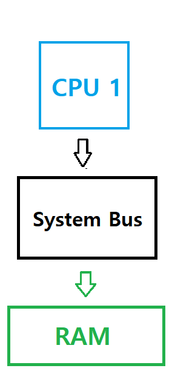
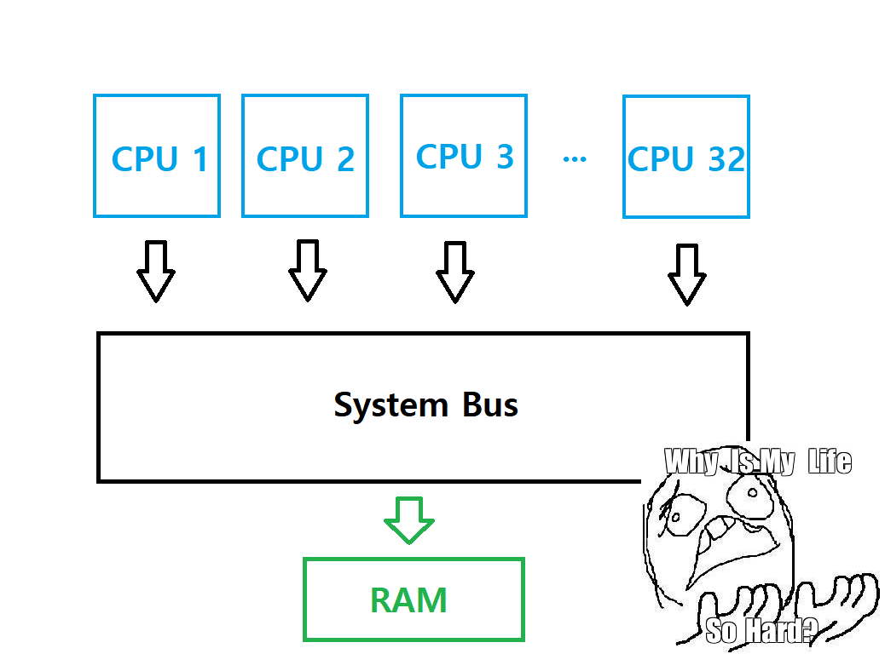
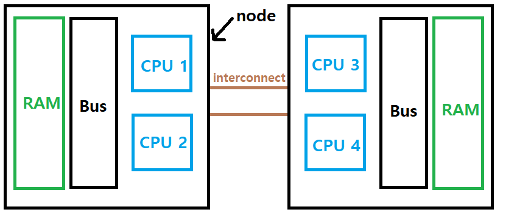

## Work in progress

This document is WIP; Some fields are not explained yet.

## NUMA node

## What is UMA and NUMA Architecture?



Usual PCs have only one memory controller. That's true for the author's PC and maybe yours too. Because there is only one memory controller, access latency to memory is uniform across the system. It's called UMA (Uniform Memory Access) architecture. Main problem of such system is that it does not scale as number of cpus increases.



Let's say, we have 32 CPUs in a single computer. As a memory controller can communicate with a single CPU simulatenously, Other 31 CPUs should always just wait. That's significant performance penalty when a workload is memory-intensive. (Even if the existence of cache loosens this situation.)  



One solution to this problem is to impelment multiple memory controllers. It's called NUMA (Non-Uniform Memory Access). As it has multiple memory controllers, only some of cpus share a memory controller. (or there will be only one cpu) The set of CPU(s) and memory is called "NUMA node". The memory thoughput can scale with number of CPUs if we increase number of NUMA nodes.

In our example, the left node is local to CPU 1 and 2. Accessing from local node is fastest. If CPU 1 and 2 allocate memory from right node (remote node), they have to access through "interconnect", which increases latency so much. So the page allocator tries to allocate pages from local node as possible.  

Supporting NUMA architecture is important because allocating remote node's memory can result in poor performance in NUMA architecture. In 1990-2000s, NUMA architecture gained its popularity and supports to NUMA architecture is added to Linux.  

## How Linux manages nodes
in Linux, a NUMA node is represented in struct pglist_data (or pg_data_t). On UMA (CONFIG_NUMA is not defined), it always has global contig_page_data variable. On NUMA, there is architecture-specific arrays of pglist_data. in both cases, NODE_DATA(nid) can be used to access proper node descriptor. (nid is node id)

```c
#ifndef CONFIG_NUMA

extern struct pglist_data contig_page_data;
static inline struct pglist_data *NODE_DATA(int nid)
{
        return &contig_page_data;
}
#define NODE_MEM_MAP(nid)       mem_map

#else /* CONFIG_NUMA */

#include <asm/mmzone.h>

#endif /* !CONFIG_NUMA */
```

## struct pgdata_list

a NUMA node is represented in struct pgdata_list (or pg_data_t) in linux. it's defined in include/linux/mmzone.h:

```c
/*
 * On NUMA machines, each NUMA node would have a pg_data_t to describe
 * it's memory layout. On UMA machines there is a single pglist_data which
 * describes the whole memory.
 *
 * Memory statistics and page replacement data structures are maintained on a
 * per-zone basis.
 */
typedef struct pglist_data {
	/*
	 * node_zones contains just the zones for THIS node. Not all of the
	 * zones may be populated, but it is the full list. It is referenced by
	 * this node's node_zonelists as well as other node's node_zonelists.
	 */
	struct zone node_zones[MAX_NR_ZONES];
```
### Priority of zones on allocation
As explained above, node is a set of memory that has same access property. But sometimes we need to separate memories based on different (not a access speed) properties. So for every nodes, we can separate regions of node if needed. that's called a "zone".

```c
	/*
	 * node_zonelists contains references to all zones in all nodes.
	 * Generally the first zones will be references to this node's
	 * node_zones.
	 */
	struct zonelist node_zonelists[MAX_ZONELISTS];
```

When the page allocator allocates page(s), we can specify priorities of zones. for example, if we reserve some of memory for special purpose, let's say we have ZONE_DMA, ZONE_DMA32, ZONE_NORMAL. ZONE_NORMAL is zone for usual allocation and ZONE_DMA, ZONE_DMA32 is reserved for devices.

As ZONE_DMA{,32} is reserved for specific purpose, we should avoid allocating from them as long as possible. By specifying node_zoneslists to {ZONE_NORMAL, ZONE_DMA32, ZONE_DMA}, we can avoid allocating from ZONE_DMA{,32} when we have enough memory. (But the page allocator will try to allocate pages from ZONE_DMA32 and ZONE_DMA when it can't allocate from ZONE_NORMAL.) 

### Number of zones

```c
	int nr_zones; /* number of populated zones in this node */
```

We **can** split a node into multiple zones, but we **don't have to**. a node can have 1+ zones. the number of zones in a node is specified in nr_zones.

### Array of pages for each node, and page extension
```c
#ifdef CONFIG_FLATMEM	/* means !SPARSEMEM */
	struct page *node_mem_map;
#ifdef CONFIG_PAGE_EXTENSION
	struct page_ext *node_page_ext;
#endif
#endif
```

FLATMEM and memory models will be discussed later. To be brief, pages are managed by a continuous array in FLATMEM. in UMA, there is a global mem_map array that contains all pages in the system. in NUMA architecture, there are array of pages for each NUMA node. 

PAGE_EXTENSION is used when page extension feature enabled on 32-bit machines; By its nature, 32-bit machines can have up to 4GB of memory. But it can have more than 4GB with page extension.

### When pages can be added/removed after boot
```c
#if defined(CONFIG_MEMORY_HOTPLUG) || defined(CONFIG_DEFERRED_STRUCT_PAGE_INIT)
	/*
	 * Must be held any time you expect node_start_pfn,
	 * node_present_pages, node_spanned_pages or nr_zones to stay constant.
	 * Also synchronizes pgdat->first_deferred_pfn during deferred page
	 * init.
	 *
	 * pgdat_resize_lock() and pgdat_resize_unlock() are provided to
	 * manipulate node_size_lock without checking for CONFIG_MEMORY_HOTPLUG
	 * or CONFIG_DEFERRED_STRUCT_PAGE_INIT.
	 *
	 * Nests above zone->lock and zone->span_seqlock
	 */
	spinlock_t node_size_lock;
#endif
```

This is a spinlock that protects node_present_pages, node_spanned_pages, node_start_pfn, and nr_zones. On many systems, these fields stay constant because they're initialized in boot process and never change. But in memory hotplugging or deferred page initilization, it can change. node_size_lock is used to synchronize when those fields does not stay constant.

### Number of pages and holes in a node
```c
	unsigned long node_start_pfn;
	unsigned long node_present_pages; /* total number of physical pages */
	unsigned long node_spanned_pages; /* total size of physical page
					     range, including holes */
```

node_start_pfn is the starting pfn of a node. node_present_pages and node_spanned_pages describes how much pages a node has. the reason there are two variables is a node can have "holes".  for example, let's say a node has pages starting from pfn 1 to pfn 10, But there are no pages between pfn 5 and 6. node_present_pages is 8 and node_spanned_pages is 10.

### kswapd for memory reclamation
```c
	int node_id;
	wait_queue_head_t kswapd_wait;
	wait_queue_head_t pfmemalloc_wait;

	/* workqueues for throttling reclaim for different reasons. */
	wait_queue_head_t reclaim_wait[NR_VMSCAN_THROTTLE];

	atomic_t nr_writeback_throttled;/* nr of writeback-throttled tasks */
	unsigned long nr_reclaim_start;	/* nr pages written while throttled
					 * when throttling started. */
	struct task_struct *kswapd;	/* Protected by
					   mem_hotplug_begin/end() */
	int kswapd_order;
	enum zone_type kswapd_highest_zoneidx;

	int kswapd_failures;		/* Number of 'reclaimed == 0' runs */
```

When there are few free pages in a node, kernel wakes up a kernel thread called **kswapd**. those fields specifies how kswap should work. We will discuss kswapd soon.

### kcompactd for memory compaction

```c
#ifdef CONFIG_COMPACTION
	int kcompactd_max_order;
	enum zone_type kcompactd_highest_zoneidx;
	wait_queue_head_t kcompactd_wait;
	struct task_struct *kcompactd;
	bool proactive_compact_trigger;
#endif
```

These fields are used to describe how kcompactd should work. kcompactd is a kernel thread that actively does memory compaction. memory compaction and kcompactd will be discussed later.

```c
	/*
	 * This is a per-node reserve of pages that are not available
	 * to userspace allocations.
	 */
	unsigned long		totalreserve_pages;
```

```c
#ifdef CONFIG_NUMA
	/*
	 * node reclaim becomes active if more unmapped pages exist.
	 */
	unsigned long		min_unmapped_pages;
	unsigned long		min_slab_pages;
#endif /* CONFIG_NUMA */

	/* Write-intensive fields used by page reclaim */
	ZONE_PADDING(_pad1_)
```
	
```c
#ifdef CONFIG_DEFERRED_STRUCT_PAGE_INIT
	/*
	 * If memory initialisation on large machines is deferred then this
	 * is the first PFN that needs to be initialised.
	 */
	unsigned long first_deferred_pfn;
#endif /* CONFIG_DEFERRED_STRUCT_PAGE_INIT */
```

### Transparent Huge Pages

```c
#ifdef CONFIG_TRANSPARENT_HUGEPAGE
	struct deferred_split deferred_split_queue;
#endif
```
### lruvec
```c
	/* Fields commonly accessed by the page reclaim scanner */

	/*
	 * NOTE: THIS IS UNUSED IF MEMCG IS ENABLED.
	 *
	 * Use mem_cgroup_lruvec() to look up lruvecs.
	 */
	struct lruvec		__lruvec;
```

### flags
```
	unsigned long		flags;

	ZONE_PADDING(_pad2_)
```

### Node statistics
```c
	/* Per-node vmstats */
	struct per_cpu_nodestat __percpu *per_cpu_nodestats;
	atomic_long_t		vm_stat[NR_VM_NODE_STAT_ITEMS];
} pg_data_t;
```
These two fields are used to describe statistics of a node. it's useful when monitoring how the memory is used. Try reading /proc/meminfo for example. it's based on these statistics fields.

### What is ZONE_PADDING?
There are some fields defined using ZONE_PADDING() macro. This padding ensures that frequently accessed fields does not share a cache line. As node is shared across (some of) CPUs, There will be some of cache synchronization cost if frequently accessed fields share a cache line.
