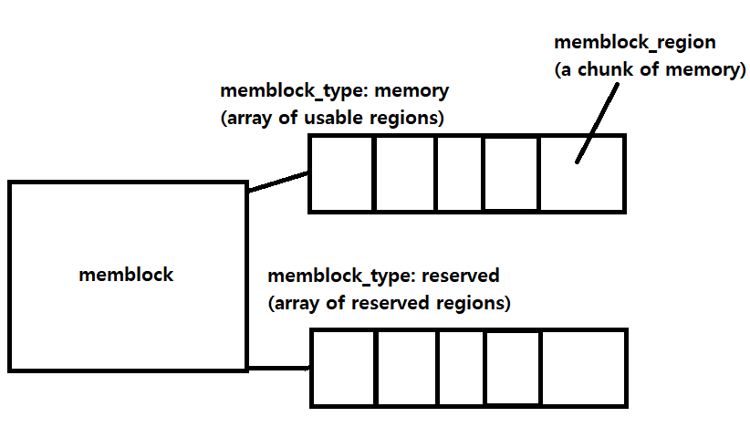

# memblock

Before initialization of buddy allocator, there are few way to allocate memory, like heap. But kernel needs not a small amount of memory in boot process. So there is **memblock:** it's a memory allocator in boot process before initialization of buddy allocator.


### struct memblock\_region

```c
/**
 * struct memblock_region - represents a memory region
 * @base: base address of the region
 * @size: size of the region
 * @flags: memory region attributes
 * @nid: NUMA node id
 */
struct memblock_region {
	phys_addr_t base;
	phys_addr_t size;
	enum memblock_flags flags;
#ifdef CONFIG_NUMA
	int nid;
#endif
};
```

memblock's view of system memory is collection of _memory regions_. each region has base address, size, and flags (and maybe NUMA node if CONFIG\_NUMA=y). This is very similar to **E820 memory map.**

### **struct memblock\_type**

```c
/**
 * struct memblock_type - collection of memory regions of certain type
 * @cnt: number of regions
 * @max: size of the allocated array
 * @total_size: size of all regions
 * @regions: array of regions
 * @name: the memory type symbolic name
 */
struct memblock_type {
	unsigned long cnt;
	unsigned long max;
	phys_addr_t total_size;
	struct memblock_region *regions;
	char *name;
};
```

As system memory is not a big, single and continuous region, kernel needs array of struct memblock\_region. struct memblock\_type is for this purpose; it's a _collection of memory regions of certain type_. Note that the size of array is not static; it is doubled when the array is full.

### struct memblock

```c
/**
 * struct memblock - memblock allocator metadata
 * @bottom_up: is bottom up direction?
 * @current_limit: physical address of the current allocation limit
 * @memory: usable memory regions
 * @reserved: reserved memory regions
 */
struct memblock {
	bool bottom_up;  /* is bottom up direction? */
	phys_addr_t current_limit;
	struct memblock_type memory;
	struct memblock_type reserved;
};
```

We saw struct memblock\_type is an array of regions. struct memblock represents the whole memory. we have two types of array of regions for the system**:** **reserved** or **memory** (available).

Note that the memblock\_type _grows_ as boot process progresses. The whole memory may not be available in very early boot time. the direction of growing maybe top-down or bottom-up. _(bool bottom\_up)_

_current\_limit_ is the maximum (or minimum) limit of current memblock.



struct memblock is statically initialized at [mm/memblock.c](https://elixir.bootlin.com/linux/v5.18-rc4/source/mm/memblock.c#L111):

```c
struct memblock memblock __initdata_memblock = {
	.memory.regions		= memblock_memory_init_regions,
	.memory.cnt		= 1,	/* empty dummy entry */
	.memory.max		= INIT_MEMBLOCK_REGIONS,
	.memory.name		= "memory",

	.reserved.regions	= memblock_reserved_init_regions,
	.reserved.cnt		= 1,	/* empty dummy entry */
	.reserved.max		= INIT_MEMBLOCK_RESERVED_REGIONS,
	.reserved.name		= "reserved",

	.bottom_up		= false,
	.current_limit		= MEMBLOCK_ALLOC_ANYWHERE,
};
```

### APIs

There are various functions memblock provides. But all of them are based on two basic primitives: memblock\_add() and memblock\_reserve().


#### memblock\_add\_range()


#### memblock\_reserve()


### References


